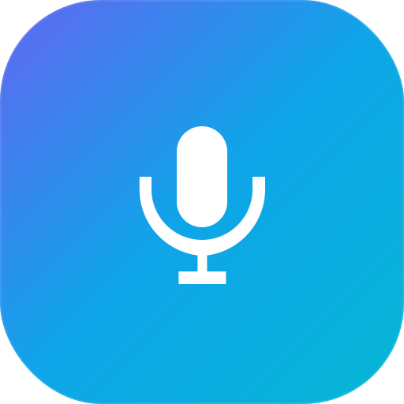
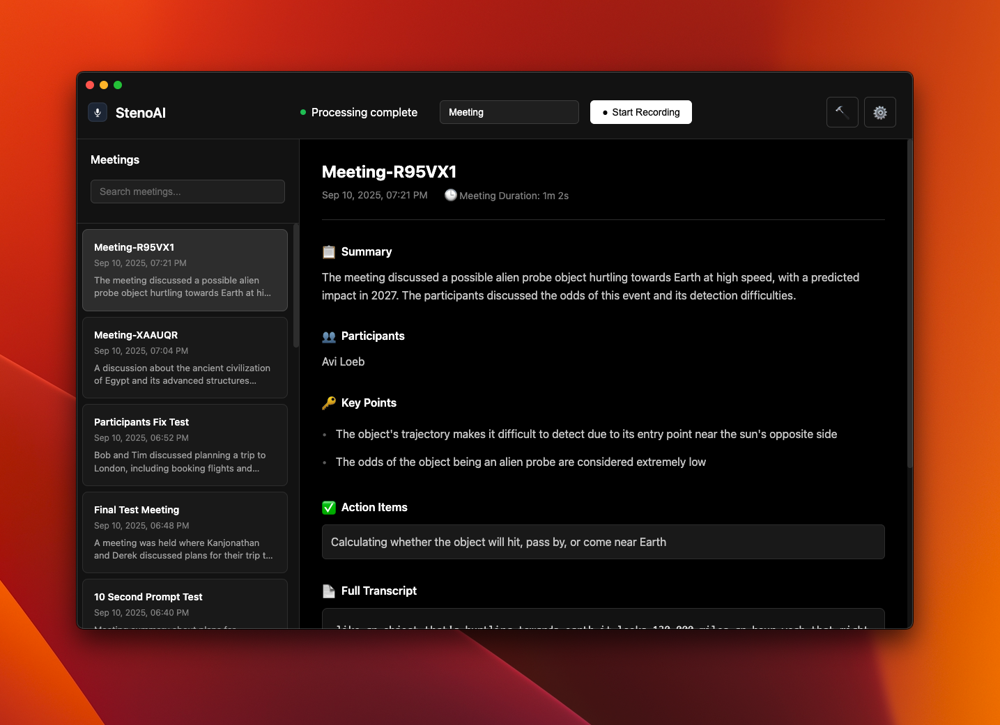

<div align="center">
  
  
  # StenoAI
</div>

AI-powered meeting transcription and summarization that runs entirely on your device using small lanuage models locally hosted. Privacy first approach & zero service costs.

<div align="center">
  
</div>

## Features

- **Local transcription** using OpenAI Whisper
- **AI summarization** with Ollama models
- **Privacy-first** - no cloud dependencies
- **macOS desktop app** with intuitive interface

## Future Roadmap

### Enhanced Features
- Custom summarization templates
- Speaker Diarisation
- Ability to select different local models like qwen, gemma etc. Currently, limited to llama3.2

### Bring Your Own AI API
- Support for OpenAI GPT models via API key
- Anthropic Claude integration for summarization
- Azure OpenAI service compatibility
- User choice between local and cloud processing
- Web Browser/Web GPU based processing

## Installation

Download the latest release for your Mac:

- [Apple Silicon (M1/M2/M3/M4)](https://github.com/ruzin/stenoai/releases/latest/download/stenoAI-macos-arm64.dmg)
- [Intel Macs](https://github.com/ruzin/stenoai/releases/latest/download/stenoAI-macos-x64.dmg) Performance on Intel Macs is limited due to lack of dedicated AI inference capabilities on these older chips.

### Installing on macOS

Since StenoAI is not code-signed with an Apple Developer certificate, you'll need to bypass macOS security warnings:

1. **Download DMG** → You may see "StenoAI is damaged and can't be opened"
2. **Right-click the DMG** → Select **"Open"** → Click **"Open"** in the dialog
3. **Drag StenoAI to Applications** folder
4. **If the app won't launch**, run this command in Terminal:
   ```bash
   xattr -cr /Applications/StenoAI.app
   ```
5. **Right-click StenoAI in Applications** → Select **"Open"** → Click **"Open"**

The app will then work normally on subsequent launches.

You can run it locally as well (see below) if you dont want to install a dmg.

## Local Development/Use Locally

### Prerequisites
- Python 3.8+
- Node.js 18+
- Homebrew

### Setup
```bash
git clone https://github.com/ruzin/stenoai.git
cd stenoai

# Backend
python3 -m venv venv
source venv/bin/activate
pip install -r requirements.txt

# Install Ollama
brew install ollama
ollama serve &
ollama pull llama3.2:3b

# Install ffmpeg (required for audio processing)
brew install ffmpeg

# Frontend
cd app
npm install
npm start
```

### Build
```bash
cd app
npm run build
```

## Release Process

### Simple Release Commands
```bash
cd app

# Patch release (bug fixes): 0.0.5 → 0.0.6
npm version patch
git add package.json package-lock.json
git commit -m "Version bump to $(node -p "require('./package.json').version")"
git push
git tag v$(node -p "require('./package.json').version")
git push origin v$(node -p "require('./package.json').version")

# Minor release (new features): 0.0.6 → 0.1.0
npm version minor
git add package.json package-lock.json
git commit -m "Version bump to $(node -p "require('./package.json').version")"
git push
git tag v$(node -p "require('./package.json').version")
git push origin v$(node -p "require('./package.json').version")

# Major release (breaking changes): 0.0.6 → 1.0.0
npm version major
git add package.json package-lock.json
git commit -m "Version bump to $(node -p "require('./package.json').version")"
git push
git tag v$(node -p "require('./package.json').version")
git push origin v$(node -p "require('./package.json').version")
```

**What happens:**
1. `npm version` updates package.json and package-lock.json locally
2. Manual commit ensures version changes are saved to git
3. `git push` sends the version commit to GitHub
4. `git tag` creates the version tag locally
5. `git push origin tag` triggers GitHub Actions workflow
6. Workflow automatically builds DMGs for Intel & Apple Silicon
7. Creates GitHub release with downloadable assets


## Models & Performance

**Transcription Models** (Whisper):
- `small`: Default model - good accuracy and speed on Apple Silicon (recommended)
- `base`: Faster but lower accuracy for basic meetings
- `medium`: High accuracy for important meetings (slower)

**Summarization Models** (Ollama):
- `llama3.2:3b`: Good quality, moderate speed (recommended)

## Project Structure

```
stenoai/
├── app/                  # Electron desktop app
├── src/                  # Python backend
├── website/              # Marketing site
├── recordings/           # Audio files
├── transcripts/          # Text output
└── output/              # Summaries
```

## Troubleshooting

### Debug Logs

StenoAI includes a built-in debug panel for troubleshooting issues:

**In-App Debug Panel:**
1. Launch StenoAI
2. Click the 🔨 hammer icon (next to settings)
3. The debug panel shows real-time logs of all operations

**Terminal Logging (Advanced):**
For detailed system-level logs, run the app from Terminal:
```bash
# Launch StenoAI with full logging
/Applications/StenoAI.app/Contents/MacOS/StenoAI
```

This displays comprehensive logs including:
- Python subprocess output
- Whisper transcription details  
- Ollama API communication
- HTTP requests and responses
- Error stack traces
- Performance timing

**System Console Logs:**
For system-level debugging:
```bash
# View recent StenoAI-related logs
log show --last 10m --predicate 'process CONTAINS "StenoAI" OR eventMessage CONTAINS "ollama"' --info

# Monitor live logs
log stream --predicate 'eventMessage CONTAINS "ollama" OR process CONTAINS "StenoAI"' --level info
```

**Common Issues:**
- **Recording stops early**: Check microphone permissions and available disk space
- **"Processing failed"**: Usually Ollama service or model issues - check terminal logs
- **Empty transcripts**: Whisper couldn't detect speech - verify audio input levels
- **Slow processing**: Normal for longer recordings - Ollama processing is CPU-intensive especially on older intel Macs

### Logs Location
- **User Data**: `~/Library/Application Support/stenoai/`
- **Recordings**: `~/Library/Application Support/stenoai/recordings/`
- **Transcripts**: `~/Library/Application Support/stenoai/transcripts/`
- **Summaries**: `~/Library/Application Support/stenoai/output/`

## License

MIT