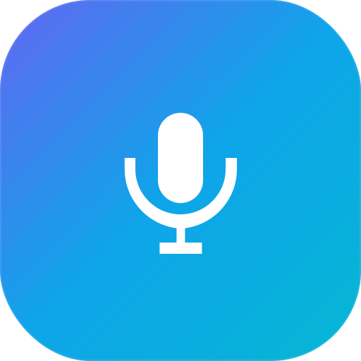
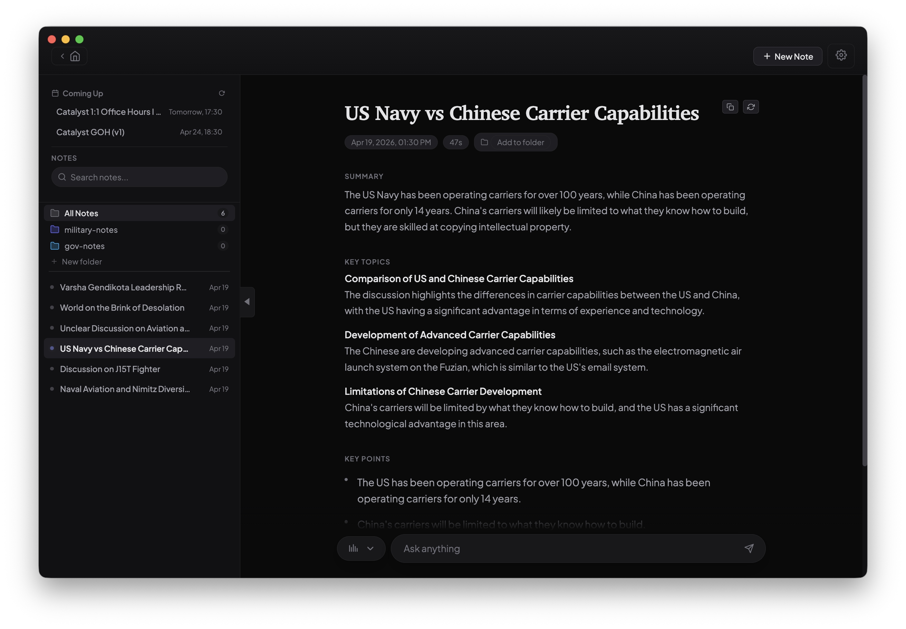

<div align="center">
  

  # StenoAI

  *Your private stenographer for every meeting*
</div>

<p align="center">
  <a href="https://github.com/ruzin/stenoai/actions/workflows/build-release.yml"></a>
  <a href="https://github.com/ruzin/stenoai/releases"></a>
  <a href="https://discord.gg/DZ6vcQnxxu"></a>
  <a href="LICENSE"></a>
  
</p>

<p align="center">AI-powered meeting intelligence that runs entirely on your device, your private data never leaves anywhere. Record, transcribe, summarize, and query your meetings using local AI models. Perfect for healthcare, legal and finance professionals with confidential data needs.</p>

<p align="center"><sub>Trusted by users at <b>AWS</b> & <b>Deliveroo</b>.</sub></p>

<div align="center">
  

  <br>

  [](https://x.com/ruzin_saleem)
</div>

<p align="center"><sub><i>Disclaimer: This is an independent open-source project for meeting-notes productivity and is not affiliated with, endorsed by, or associated with any similarly named company.</i></sub></p>

## 📢 What's New
- **2026-03-23** 🗣️ Speaker diarisation — [You] vs [Others] labels for system audio recordings
- **2026-03-23** 🌍 Auto-detect language — 99 languages supported out of the box
- **2026-03-04** 🏷️ Auto-generated meeting titles — AI creates short titles from your transcripts
- **2026-03-04** ⌨️ macOS Shortcuts support — Start/stop recordings via Apple Shortcuts deep links
- **2026-03-04** 🤖 Updated model lineup — Qwen 3.5 9B, DeepSeek-R1 14B, GPT-OSS 20B; Ollama v0.17.5
- **2026-03-04** 🙈 Hide dock icon — Run StenoAI in menu-bar-only mode
- **2026-02-22** 🌍 Multi-language support — Transcribe and summarize in 10 languages
- **2026-02-19** 🎧 System audio capture — Record both sides of virtual meetings, even with headphones on

## Features

- **Local transcription** using whisper.cpp
- **AI summarization** with Ollama models
- **Privacy-first** - 100% local processing, your data never leaves your device
- **Multiple AI models** - Choose from 5 models optimized for different use cases
- **Ask Steno** - Query your meetings with natural language questions
- **Multi-language support** - Auto-detect and transcribe 99 languages
- **Speaker diarisation** - [You] vs [Others] labels for system audio recordings
- **Remote Ollama server** - Run AI models on another machine on your network
- **System audio capture** - Record mic + system audio simultaneously for virtual meetings with headphones
- **macOS desktop app** with intuitive interface

## macOS Shortcuts (Optional)

<details>
<summary>Expand setup and calendar automation guide</summary>

StenoAI supports Apple Shortcuts via deep links using the `stenoai://` URL scheme.

- Start recording: `stenoai://record/start?name=Daily%20Standup`
- Stop recording: `stenoai://record/stop`

### How to set it up

1. Open the **Shortcuts** app on macOS.
2. Create a new shortcut (for example: "Start StenoAI Recording").
3. Add the **Open URLs** action.
4. Use one of the URLs above.
5. (Optional) Add a keyboard shortcut from the shortcut settings.

### Calendar event naming (optional)

If you want calendar-based names, resolve the event title in your Shortcut workflow and pass it as the `name` query value in the start URL.

Example:

`stenoai://record/start?name=Weekly%20Product%20Sync`

### Calendar event start automation (via Rules bridge)

macOS Shortcuts **cannot natively trigger** exactly at Calendar event start.  
To run this automatically on event timing, a third-party automation app is required.

This addon uses:

- **Apple Shortcuts**: builds the `stenoai://record/start?...` action.
- **Rules – Calendar Automation**: watches Calendar events and triggers the shortcut.

#### Architecture overview

1. Rules App monitors upcoming Calendar events.
2. Rules checks the event note/body for a marker keyword (for example `stenoai`).
3. If matched, Rules runs a Shortcut.
4. The Shortcut gets the next event title and opens:
   - `stenoai://record/start?name={calendar_event_title}`
5. StenoAI receives the URL and starts recording with that name.

#### Step-by-step setup

1. Install **Rules – Calendar Automation** on macOS.
2. Create a Shortcut in Apple Shortcuts (example name: `StenoAI Start From Calendar Event`).
3. In that Shortcut, add actions in this order:
   - `Find Calendar Events` (limit to `1`, sorted by start date ascending, upcoming only)
   - Extract the event title from the found event
   - `URL Encode` the title
   - `Open URLs` with:
     - `stenoai://record/start?name=<encoded title>`
4. Open Rules and create a calendar-trigger rule:
   - Source: your target calendar(s)
   - Trigger window: event start (or preferred offset)
   - Condition: event note contains `stenoai`
   - Action: run Shortcut `StenoAI Start From Calendar`
5. In your Calendar event notes, add the word `stenoai` for meetings that should auto-start recording.
6. Test with a near-future event:
   - create event with `stenoai` in notes,
   - wait for trigger,
   - confirm StenoAI starts and uses the event title as session name.

#### Notes

- Without Rules (or another automation bridge), this cannot be fully event-driven from Calendar start time.
- Keep using regular manual shortcuts (`Open URLs`) for non-automated scenarios.

Have questions or suggestions? [Join our Discord](https://discord.gg/DZ6vcQnxxu) to chat with the community.
</details>

## Models & Performance

**Transcription Models** (Whisper):
- `small`: Default model - good accuracy and speed on Apple Silicon **(default)**
- `base`: Faster but lower accuracy for basic meetings
- `medium`: High accuracy for important meetings (slower)

**Summarization Models** (Ollama):
- `llama3.2:3b` (2GB): Fast and lightweight for quick meetings **(default)**
- `gemma3:4b` (2.5GB): Lightweight and efficient
- `qwen3.5:9b` (6.6GB): Excellent at structured output and action items
- `deepseek-r1:14b` (9.0GB): Strong reasoning and analysis capabilities
- `gpt-oss:20b` (14GB): OpenAI open-weight model with reasoning capabilities

## Future Roadmap

### Enhanced Features
- Custom summarization templates
- Speaker Diarisation

### StenoAI Med
- HIPAA compliance for healthcare workflows
- EHR integration for medical notes

## Installation

Download the latest release for your Mac (**requires macOS 14 Sonoma or later**):

- [Apple Silicon (M1-M5)](https://github.com/ruzin/stenoai/releases/latest/download/stenoAI-macos-arm64.dmg)
- [Intel Macs](https://github.com/ruzin/stenoai/releases/latest/download/stenoAI-macos-x64.dmg) Performance on Intel Macs is limited due to lack of dedicated AI inference capabilities on these older chips.

### Installing on macOS

1. **Download and open the DMG file**
2. **Drag the app to Applications**
3. **When you first launch the app**, macOS may show a security warning
4. **To fix this warning:**
   - Go to **System Settings > Privacy & Security** and click **"Open Anyway"**

   **Alternatively:**
   - Right-click StenoAI in Applications and select **"Open"**
   - Or run in Terminal: `xattr -cr /Applications/StenoAI.app`
5. **The app will work normally on subsequent launches**

You can run it locally as well (see below) if you don't want to install a DMG.

## Local Development/Use Locally

### Prerequisites
- Python 3.9+
- Node.js 18+

### Setup
```bash
git clone https://github.com/ruzin/stenoai.git
cd stenoai

# Backend setup
python3 -m venv venv
source venv/bin/activate
pip install -r requirements.txt

# Download bundled binaries (Ollama, ffmpeg)
./scripts/download-ollama.sh

# Build the Python backend
pip install pyinstaller
pyinstaller stenoai.spec --noconfirm

# Frontend
cd app
npm install
npm start
```

Note: Ollama and ffmpeg are bundled - no system installation needed. The setup wizard in the app will download the required AI models automatically.

### Build
```bash
cd app
npm run build
```

## Project Structure

```
stenoai/
├── app/                  # Electron desktop app
├── src/                  # Python backend
├── website/              # Marketing site
├── recordings/           # Audio files
├── transcripts/          # Text output
└── output/              # Summaries
```

## Troubleshooting

### Debug Logs

**Setup wizard debug console:** during first-time setup, expand the debug console panel to see real-time logs of model downloads and service startup.

**Terminal logging (recommended for runtime issues):** launch the app from a terminal to stream all logs (Python subprocess output, Whisper transcription, Ollama API traffic, error stack traces):
```bash
/Applications/StenoAI.app/Contents/MacOS/StenoAI
```

**System Console:**
```bash
# View recent StenoAI-related logs
log show --last 10m --predicate 'process CONTAINS "StenoAI" OR eventMessage CONTAINS "ollama"' --info

# Monitor live logs
log stream --predicate 'eventMessage CONTAINS "ollama" OR process CONTAINS "StenoAI"' --level info
```

### Common Issues

- **Update didn't install**: Auto-updates are applied on next quit. Quit via the **StenoAI → Quit** menu (not just closing the window), then reopen.
- **No system audio / no `[Others]` speaker labels**: macOS needs **Screen Recording** permission. Go to **System Settings → Privacy & Security → Screen & System Audio Recording**, enable StenoAI, and relaunch the app.
- **`stenoai://` deep link doesn't start recording**: Make sure StenoAI has launched at least once after install so the URL scheme is registered. If it still fails, check the terminal log for `Protocol handler registration` output.
- **Recording stops early**: Check microphone permissions, Screen Recording permission (if using system audio), and available disk space.
- **"Processing failed"**: Usually an Ollama service or model issue — check the terminal logs.
- **Empty transcripts**: Whisper couldn't detect speech — verify audio input levels.
- **Slow processing**: Normal for longer recordings; Ollama is CPU-intensive, especially on older Intel Macs.

### Logs Location
- **User Data**: `~/Library/Application Support/stenoai/`
- **Recordings**: `~/Library/Application Support/stenoai/recordings/`
- **Transcripts**: `~/Library/Application Support/stenoai/transcripts/`
- **Summaries**: `~/Library/Application Support/stenoai/output/`

## License

This project is licensed under the [MIT License](LICENSE).
