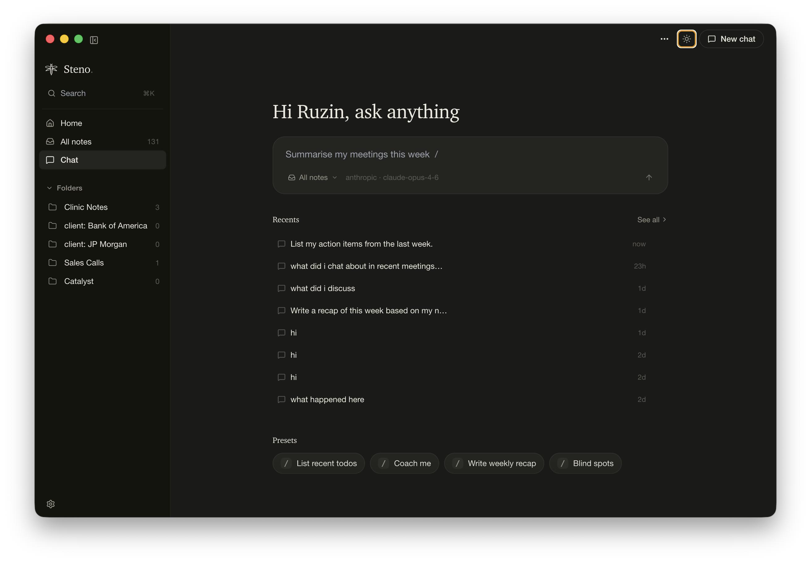

<div align="center">
  

  # Steno

  *Your private stenographer*
</div>

<p align="center">
  <a href="https://github.com/ruzin/stenoai/actions/workflows/build-release.yml"></a>
  <a href="https://github.com/ruzin/stenoai/releases"></a>
  <a href="https://discord.gg/DZ6vcQnxxu"></a>
  <a href="LICENSE"></a>
  
  <a href="#sponsors"></a>
</p>

<p align="center">Steno is the AI powered intelligence layer for all your confidential conversations, your private data never leaves anywhere. Record, transcribe, summarize, and query your meetings using local AI models. Perfect for government, defence, legal and C-suite professionals with confidential data needs.</p>

<p align="center"><sub>Trusted by users at <b>AWS</b>, <b>Deliveroo</b>, <b>Tesco</b>, <b>Hashicorp</b>, <b>Rutgers</b> & <b>European Union</b>.</sub></p>

<div align="center">
  <picture>
    <source srcset="website/public/demo.gif" type="image/gif">
    
  </picture>

  <br>

  [](https://x.com/ruzin_saleem)
</div>

<p align="center"><sub>Sponsored by <b>Gitlab Founder's Open Core Ventures</b>.</sub></p>

<p align="center"><sub><i>Disclaimer: This is an independent open-source project for meeting-notes productivity and is not affiliated with, endorsed by, or associated with any similarly named company.</i></sub></p>

## Sponsors

### Recall.ai - API for desktop recording

If you're looking for a hosted desktop recording API, consider checking out [Recall.ai](https://www.recall.ai/product/desktop-recording-sdk?utm_source=github&utm_medium=sponsorship&utm_campaign=ruzin-stenoai), an API that records Zoom, Google Meet, Microsoft Teams, in-person meetings, and more.

## 📢 What's New
- **2026-06-01** 🔒 Enterprise adapter HTTPS fix — Summaries, meeting titles, and shared-note backups via your org's Steno adapter were silently failing with a TLS verification error on clean Macs that don't have Homebrew. The bundle now ships its own CA trust store and uses it unconditionally — no user action required.
- **2026-06-01** ⏯️ Back-to-back recordings — Start a new note while a previous one is still processing in the background, instead of waiting for it to finish. The previous recording continues through the queue normally. Useful when meetings stack and you're on a heavier Whisper model.
- **2026-06-01** 🔁 Share/Unshare toggle on shared notes — The kebab menu now reflects whether a note is actually shared with your org. Already-shared notes show "Unshare from <org>" instead of letting you re-share and create duplicates in the org meetings store.
- **2026-06-01** 🧹 Cleaner default note titles — When summarisation produces no title (silent recording, model returned junk), the placeholder is now just "Note" rather than leaking the auto-detect internals like `an app — 2026-06-01 17:00`.
- **2026-06-01** 🤖 Organisation AI provider — Sign in to your org and Steno routes summaries, titles, and cross-note chat through your org's adapter automatically. No more pasting an Anthropic key in Settings → AI for users on a managed deployment.
- **2026-06-01** 🔐 30-day sign-in + sidebar CTA — Org sessions now last 30 days (was 8 h). A prominent "Sign in to org" button appears in the sidebar for users who've connected before, replacing the hidden Settings tab as the recovery path.
- **2026-05-31** 📝 Transcripts on shared notes — Notes shared with your org now include the full transcript, surfaced via the floating Transcript panel just like local notes.
- **2026-05-31** 📅 Calendar event titles for scheduled meetings — When Google/Outlook calendar is connected, the "Meeting detected" notification and recording name use your scheduled event title instead of `<App> — <timestamp>`.
- **2026-05-31** 🪲 Dragonfly menu bar icon — Tray icon now matches the dock and sidebar brand instead of a generic waveform.
- **2026-05-28** 🔇 Quieter Meeting detected — Dictation tools (Wispr Flow, Apple Dictation, etc.) and other apps that open the mic no longer trigger the "Meeting detected" notification.
- **2026-05-22** 🎙️ Smarter titles for auto-detect recordings — Recordings started via the "Meeting detected" notification now get an AI-generated title from the transcript after summarisation, instead of staying as `<App> — <timestamp>` forever.
- **2026-05-22** 🐛 Quieter transcripts on silent audio — Whisper.cpp's decoder loop on quiet audio (e.g. dozens of repeated `[Sounds of a question]` lines) is now caught by a post-process dedup of 5+ consecutive identical segments.
- **2026-05-17** 🎙️ Auto start/stop meetings (Granola-style) — Steno notifies you when a meeting starts and offers to take notes; when the meeting ends it offers to summarise. Toggle in Settings → General (default ON).


## Features

- **Privacy-first** — 100% on-device; your recordings, transcripts, and summaries never leave your Mac
- **Auto start/stop meetings** — Steno notifies you when a meeting starts and offers to take notes, then offers to summarise when it ends (Granola-style)
- **In-app note-taking** — Jot notes while you record; they're folded straight into the AI summary
- **Ask your meetings** — Natural-language Q&A across a single note or your entire library via the Chat tab (summary, key topics, full transcript)
- **System audio capture** — Record both sides of virtual meetings, headphones on, no extra setup. Native Core Audio Tap on macOS 14.4+ with automatic fallback on older versions
- **Speaker diarisation** — `[You]` vs `[Others]` labels on system-audio recordings
- **Multi-language** — Auto-detect and transcribe in 99 languages
- **Markdown notes** — Summaries and transcripts saved as clean Markdown you can edit, search, or sync
- **Whisper model picker** — Choose your accuracy/speed tradeoff in Settings → Transcribe and download models in-app with a progress bar
- **Auto-updates** — New versions download in the background and install on next quit; a top-right toast lets you know when one's ready
- **macOS Shortcuts** — Start and stop recordings via `stenoai://` deep links for calendar-driven automation
- **Remote Ollama server** — Offload summarisation to a beefier Mac or workstation on your network
- **Bring your own cloud model** — Optional OpenAI, Anthropic, or custom API endpoint for users who prefer a hosted LLM
- **Organisation AI** — On managed deployments, sign in to your org's Steno adapter and AI routes through it automatically — no local API key, no setup
- **Under the hood** — Local transcription via whisper.cpp, summarisation via bundled Ollama (5 models to choose from)

## macOS Shortcuts (Optional)

<details>
<summary>Expand setup and calendar automation guide</summary>

Steno supports Apple Shortcuts via deep links using the `stenoai://` URL scheme.

- Start recording: `stenoai://record/start?name=Daily%20Standup`
- Stop recording: `stenoai://record/stop`

### How to set it up

1. Open the **Shortcuts** app on macOS.
2. Create a new shortcut (for example: "Start Steno Recording").
3. Add the **Open URLs** action.
4. Use one of the URLs above.
5. (Optional) Add a keyboard shortcut from the shortcut settings.

### Calendar event naming (optional)

If you want calendar-based names, resolve the event title in your Shortcut workflow and pass it as the `name` query value in the start URL.

Example:

`stenoai://record/start?name=Weekly%20Product%20Sync`

### Calendar event start automation (via Rules bridge)

macOS Shortcuts **cannot natively trigger** exactly at Calendar event start.  
To run this automatically on event timing, a third-party automation app is required.

This addon uses:

- **Apple Shortcuts**: builds the `stenoai://record/start?...` action.
- **Rules – Calendar Automation**: watches Calendar events and triggers the shortcut.

#### Architecture overview

1. Rules App monitors upcoming Calendar events.
2. Rules checks the event note/body for a marker keyword (for example `stenoai`).
3. If matched, Rules runs a Shortcut.
4. The Shortcut gets the next event title and opens:
   - `stenoai://record/start?name={calendar_event_title}`
5. Steno receives the URL and starts recording with that name.

#### Step-by-step setup

1. Install **Rules – Calendar Automation** on macOS.
2. Create a Shortcut in Apple Shortcuts (example name: `Steno Start From Calendar Event`).
3. In that Shortcut, add actions in this order:
   - `Find Calendar Events` (limit to `1`, sorted by start date ascending, upcoming only)
   - Extract the event title from the found event
   - `URL Encode` the title
   - `Open URLs` with:
     - `stenoai://record/start?name=<encoded title>`
4. Open Rules and create a calendar-trigger rule:
   - Source: your target calendar(s)
   - Trigger window: event start (or preferred offset)
   - Condition: event note contains `stenoai`
   - Action: run Shortcut `Steno Start From Calendar`
5. In your Calendar event notes, add the word `stenoai` for meetings that should auto-start recording.
6. Test with a near-future event:
   - create event with `stenoai` in notes,
   - wait for trigger,
   - confirm Steno starts and uses the event title as session name.

#### Notes

- Without Rules (or another automation bridge), this cannot be fully event-driven from Calendar start time.
- Keep using regular manual shortcuts (`Open URLs`) for non-automated scenarios.

Have questions or suggestions? [Join our Discord](https://discord.gg/DZ6vcQnxxu) to chat with the community.
</details>

## Models & Performance

**Transcription Models** (Whisper):
- `small`: Default model - good accuracy and speed on Apple Silicon **(default)**
- `base`: Faster but lower accuracy for basic meetings
- `medium`: High accuracy for important meetings (slower)

**Summarization Models** (Ollama):
- `llama3.2:3b` (2GB): Fast and lightweight for quick meetings **(default)**
- `gemma3:4b` (2.5GB): Lightweight and efficient
- `qwen3.5:9b` (6.6GB): Excellent at structured output and action items
- `deepseek-r1:14b` (9.0GB): Strong reasoning and analysis capabilities
- `gpt-oss:20b` (14GB): OpenAI open-weight model with reasoning capabilities

## Future Roadmap

### Enhanced Features
- Live transcription during recording
- NVIDIA Parakeet as a transcription engine option
- Editing notes after processing
- Windows version

## Installation

Download the latest release for your Mac (**requires macOS 14 Sonoma or later**):

- [Apple Silicon (M1-M5)](https://github.com/ruzin/stenoai/releases/latest/download/stenoAI-macos-arm64.dmg)
- [Intel Macs](https://github.com/ruzin/stenoai/releases/latest/download/stenoAI-macos-x64.dmg) Performance on Intel Macs is limited due to lack of dedicated AI inference capabilities on these older chips.

### Installing on macOS

1. **Download and open the DMG file**
2. **Drag the app to Applications**
3. **When you first launch the app**, macOS may show a security warning
4. **To fix this warning:**
   - Go to **System Settings > Privacy & Security** and click **"Open Anyway"**

   **Alternatively:**
   - Right-click Steno in Applications and select **"Open"**
   - Or run in Terminal: `xattr -cr /Applications/Steno.app`
5. **The app will work normally on subsequent launches**

You can run it locally as well (see below) if you don't want to install a DMG.

## Local Development/Use Locally

### Prerequisites
- Python 3.9+
- Node.js 18+

### Setup
```bash
git clone https://github.com/ruzin/stenoai.git
cd stenoai

# Backend setup
python3 -m venv venv
source venv/bin/activate
pip install -r requirements.txt

# Download bundled binaries (Ollama, ffmpeg)
./scripts/download-ollama.sh

# Build the Python backend
pip install pyinstaller
pyinstaller stenoai.spec --noconfirm

# Frontend
cd app
npm install
npm start
```

Note: Ollama and ffmpeg are bundled - no system installation needed. The setup wizard in the app will download the required AI models automatically.

### Build
```bash
cd app
npm run build
```

## Project Structure

```
stenoai/
├── app/                  # Electron desktop app
├── src/                  # Python backend
├── website/              # Marketing site
├── recordings/           # Audio files
├── transcripts/          # Text output
└── output/              # Summaries
```

## Troubleshooting

### Debug Logs

**Setup wizard debug console:** during first-time setup, expand the debug console panel to see real-time logs of model downloads and service startup.

**Terminal logging (recommended for runtime issues):** launch the app from a terminal to stream all logs (Python subprocess output, Whisper transcription, Ollama API traffic, error stack traces):
```bash
/Applications/Steno.app/Contents/MacOS/Steno
```

**System Console:**
```bash
# View recent Steno-related logs
log show --last 10m --predicate 'process CONTAINS "Steno" OR eventMessage CONTAINS "ollama"' --info

# Monitor live logs
log stream --predicate 'eventMessage CONTAINS "ollama" OR process CONTAINS "Steno"' --level info
```

### Common Issues

- **Update didn't install**: Auto-updates are applied on next quit. Quit via the **Steno → Quit** menu (not just closing the window), then reopen.
- **No system audio / no `[Others]` speaker labels**: macOS needs **Screen Recording** permission. Go to **System Settings → Privacy & Security → Screen & System Audio Recording**, enable Steno, and relaunch the app.
- **`stenoai://` deep link doesn't start recording**: Make sure Steno has launched at least once after install so the URL scheme is registered. If it still fails, check the terminal log for `Protocol handler registration` output.
- **Recording stops early**: Check microphone permissions, Screen Recording permission (if using system audio), and available disk space.
- **"Processing failed"**: Usually an Ollama service or model issue — check the terminal logs.
- **Empty transcripts**: Whisper couldn't detect speech — verify audio input levels.
- **Slow processing**: Normal for longer recordings; Ollama is CPU-intensive, especially on older Intel Macs.

### Logs Location
- **User Data**: `~/Library/Application Support/stenoai/`
- **Recordings**: `~/Library/Application Support/stenoai/recordings/`
- **Transcripts**: `~/Library/Application Support/stenoai/transcripts/`
- **Summaries**: `~/Library/Application Support/stenoai/output/`

## License

This project is licensed under the [MIT License](LICENSE).
